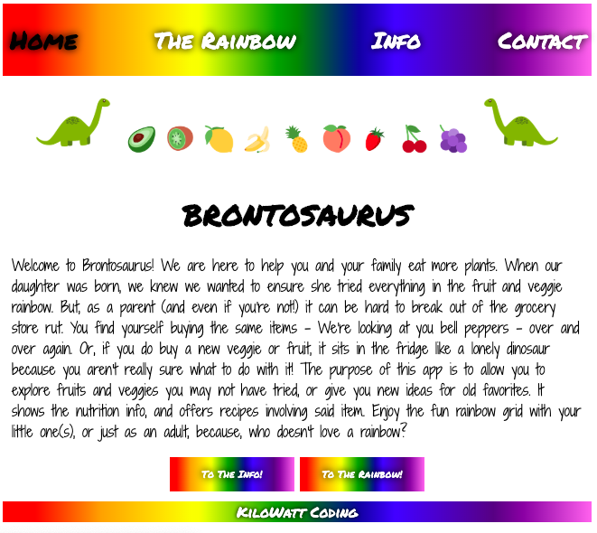
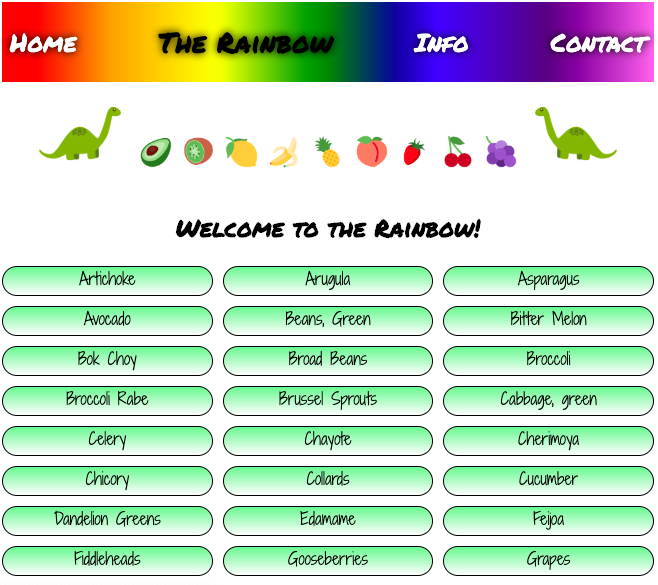
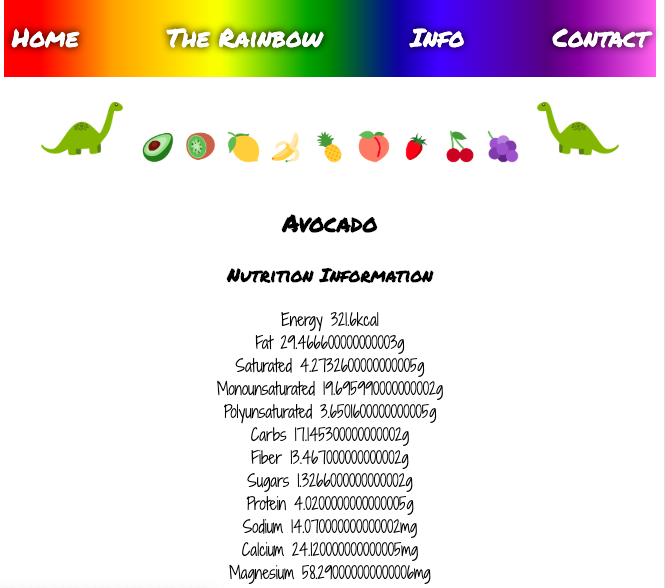
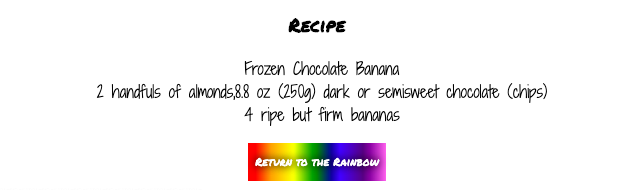
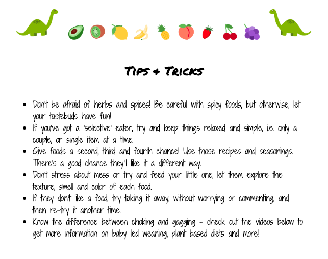
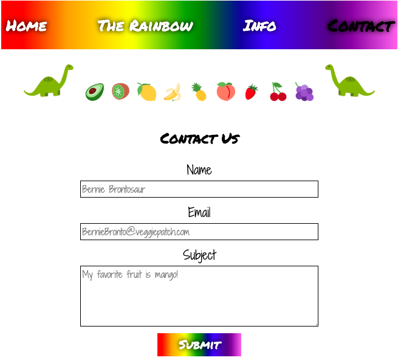

<h1> Brontosaurus </h1>

<h2> Summary: </h2>
Brontosaurus is an app aimed at parents and anyone trying to eat a more plant based diet. The goal of the app is to provide parents 
and users an immediate snapshot of what a fruit or vegetable contains in terms of nutrition info, as well as recipes that include or 
focus on that item. It also provides useful information on both eating a plant based diet, and baby led weaning. 

<h2> Live Link: </h2>
https://morvenwatt.github.io/Brontosaurus/

                                                       

<h2> Tech Used: </h2>
HTML, CSS, Javascript and JQuery.
It ustilises Edamam and Spoonacular API's.
